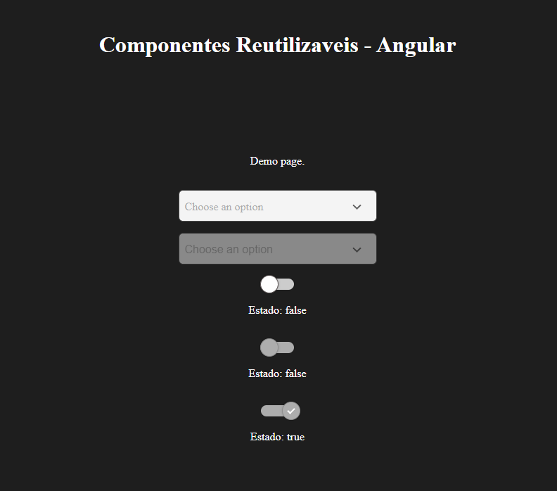
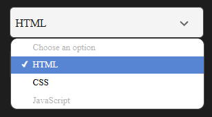
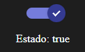

# Componentes Reutilizaveis Angular

Projetos de componentes reutilizáveis

## Imagens dos componentes

### Página de teste

<div align="center">
  
</div>

### Componentes ativos: (Select e Switch)

<div align="center">
  
  
</div>

## Estrutura

```bash
└─app
  ├─shared
  │  └─components     # Componentes utilizados para montar as páginas
  └─pages
    └───demo          # Página de demonstração dos componentes, exibido na url principal
```

## Componentes

### Switch

Componente de Switch customizável

### Propriedades

Propriedade | Tipo | Descrição
--- | --- | ---
checked | boolean | valor ativo do switch
disabled | boolean | ativa ou desativa a interação

#### Exemplo de uso

```bash
  <app-custom-switch
    [(modelValue)]="isChecked"
    [disabled]="false"
  ></app-custom-switch>
```

### Select

Componente de Select customizável

### Propriedades

Propriedade | Tipo | Descrição
--- | --- | ---
options | {value: string; label: string; disabled?:boolean}[] | lista de opções disponíveis
placeholder | string | texto exibido quando nenhum valor é selecionado
disabled | boolean | ativa ou desativa a interação

#### Exemplo de uso

```bash
  <app-custom-select
    [(ngModel)]="selectedValue"
    [options]="options"
    [disabled]="false"
  ></app-custom-select>
```

## Desenvolvimento

#### instalação

```bash
npm install
```

#### execução

```bash
npm run start
```

### Testes

```bash
npm run test
```

## Notas

- Componentes standalones, seguindo as versões mais modernas
- Os inputs seguem o padrão Angular para acessibilidade e reatividade
